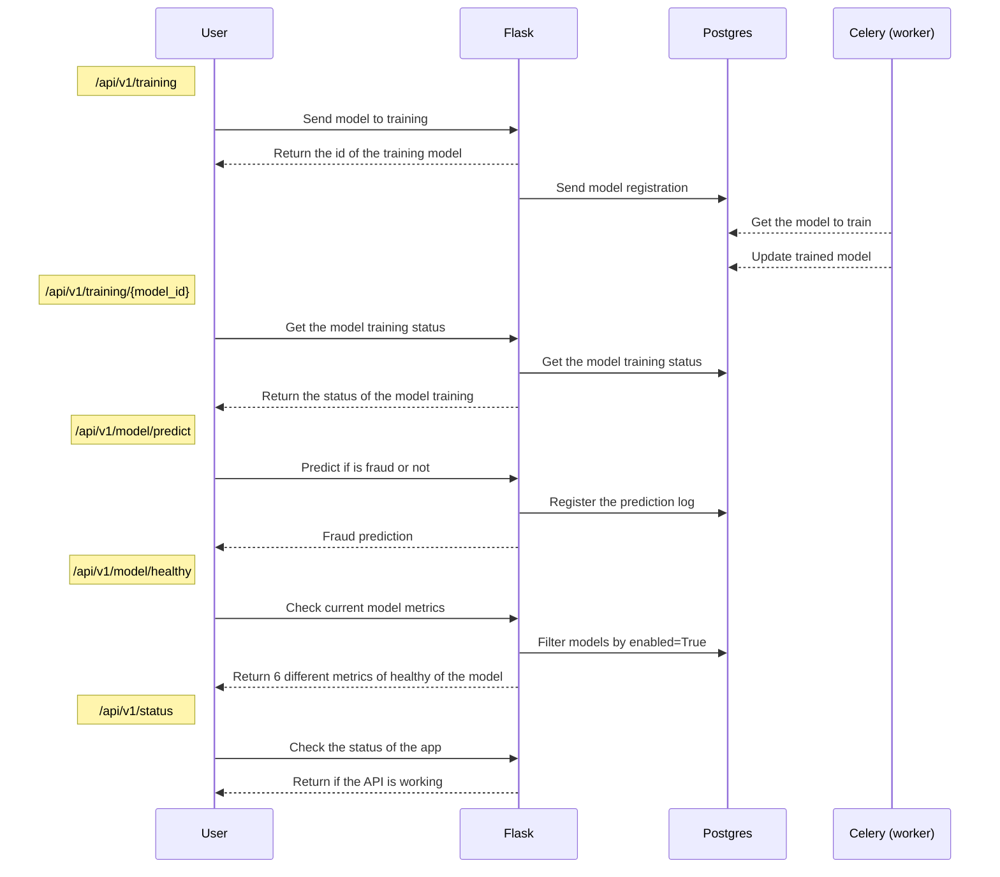

From the modeling phase, I though that was interesting to put our model in production and analyse how this will perform with new unseen data.

Beside that, the process to develop an API and serve a machine learning model is a very important skill for a Data Scientist, this way the Fraud Detection Challenge is a great opportunity to train this end to end workflow.

To better show you, how the API was developed, I separate the information into some topics:

- **Stack**
- **Infrastructure schema**
- **How to use**
- **Technical Debits**

If you want to look at the code of the API, you can access this [repository](https://github.com/LucianoBatista/fraud-detection-api).

## :fontawesome-solid-microchip: Stack


> Flask, Celery, redis, Pytest, Docker, Postgres and Heroku


## :fontawesome-solid-th: Infrastructure schema



## :fontawesome-solid-shoe-prints: How to use

The API is deployed on Heroku and as I put a Swagger interface is possible to you to interact with the API directly from the browser, just access this [link](https://salty-mesa-00197.herokuapp.com/doc).

The interface that you'll probably see is:


You'll see different routes of **POST** and **GET**. On all the POSTs you need to send some information regarding to that endpoint.

To use the endpoints you'll need to click on *Try it on*, and put the information needed. After that, you need to click on *POST* or *GET*, depending on the endpoint you choose. 

On the following image, you're seeing the Training (POST) endpoint.


Let's see about all the routes of this API.

### Routes

#### Status

This route is just a GET, and will return the status of the API, like:

``` json
/* return json */

{ 
  "status": "success", 
  "message": "pong!"
} 
```

#### Training

On the POST route of training, you'll need to **send a public link** with your csv to train the model. This route will return to you the ID of processing, and you'll use this id to check the status of the training.

```json
/* payload json */
{
  "dataset": "string"
}

/* return json */
{
    "id": int
}
```

On the GET route of training, you need to pass the id of processing within tha endpoint url. After that, you receive the status of this process: *pending, processing, processed, error.*


#### Predict

This route is responsible to apply our model on new data provided by the user. For now, we're accepting just single predictions, latter we'll accept batch predictions too.

The format that this endpoint needs to receive is:

``` json
/* payload json */
{
  "day_of_month": int,
  "type": "string",
  "amount_log": float,
  "amount_dest": float
}

```

#### Model Healthy

As we'll be using this API to re-training our model across the months, the model can be replaced if we find a better metric. So, is important that we have a healthy check, to see which model is in production.

The return from this endpoint, is:

``` json
{
  "modelname": "model_name",
  "accuracy": float,
  "recall": float,
  "f1": float,
  "enabled": bool
}

```

## :fontawesome-solid-exclamation-circle: Technical Debits

- Training route is not working properly.
- The API doesn't have a Authentication or Authorization.
- I'm not validating input and outputs.
- Just a very small portion of the code have tests :fontawesome-solid-frown: