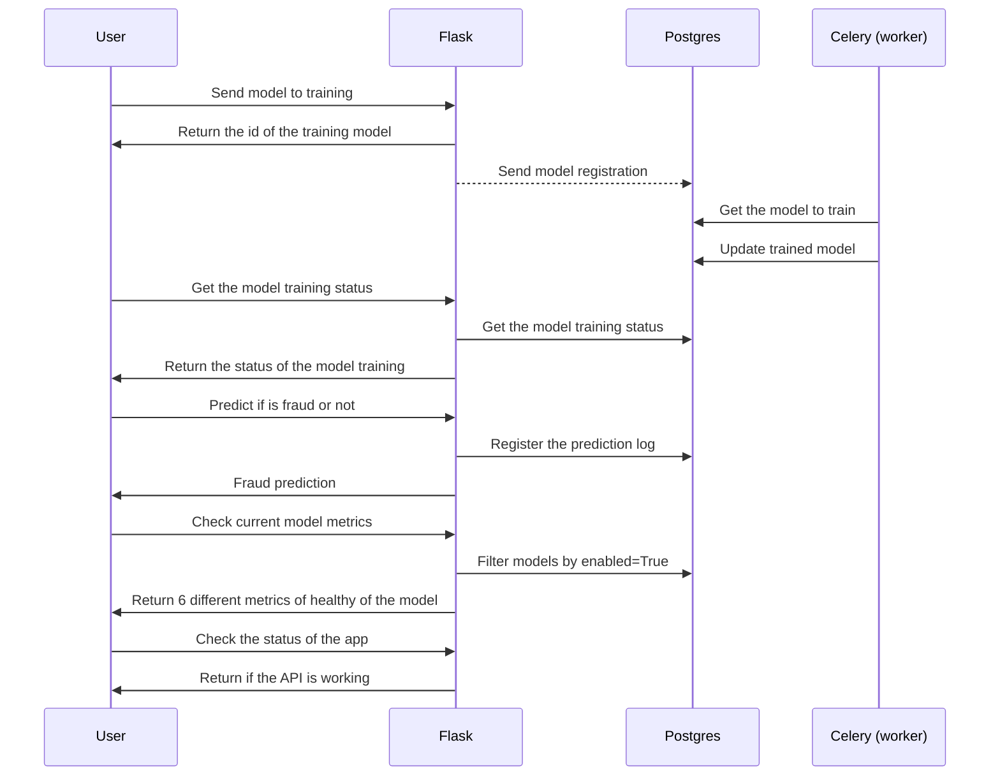
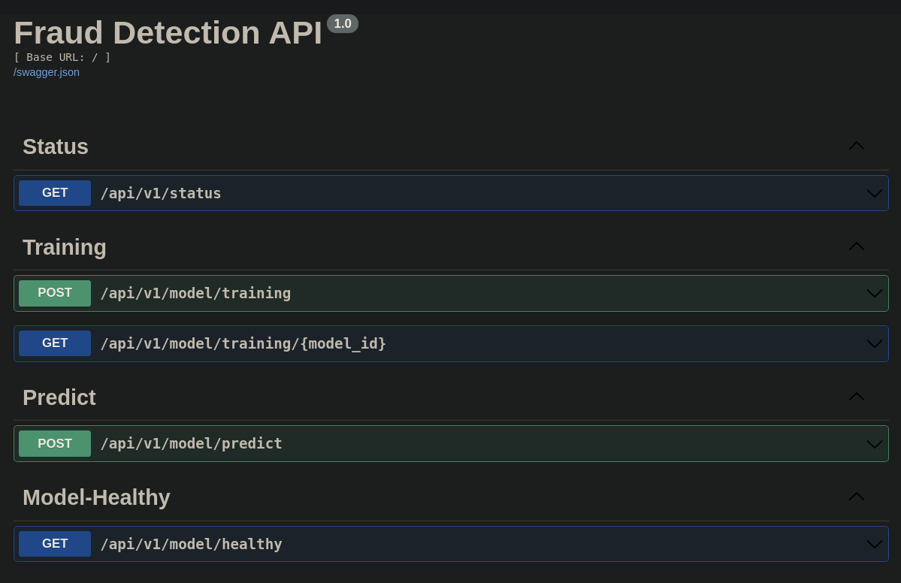

From the modeling phase, I though that was interesting to put this model in production and analyse how this will perform with new unseen data.

Beside that, the process to develop an API and serve a machine learning model is a very important skill for a Data Scientist.

Here you'll see some information about the API:

- **Stack**
- **Infrastructure schema**
- **How to use**
- **Technical Debits**

## Stack

- Flask
- Celery
- Pytest
- Redis
- Postgres
- Docker
- Heroku


## Infrastructure schema



## How to use

The API is deployed on Heroku and as I put a Swagger interface is possible to interact with the API directly from the browser, just access this [link](https://salty-mesa-00197.herokuapp.com/doc).

The interface that you'll probably see is:



You'll see different routes of POST and GET. On all the POSTs you need to send some information for the API.

On the following image, we're seeing the training route where we need to send a link with the dataset to train.


### Routes

#### Status

This route is just a GET, and will return the status of the API, like:

``` json
/* return json */

{ 
  "status": "success", 
  "message": "pong!"
} 
```

1. returning json


#### Training

On the POST route you'll need to send a public link with your csv to train the model. This route will return to you the ID of processing, and you'll use this id to check the status of the training.

```json
{
  "dataset": "string"
}

```


- Training (POST):

