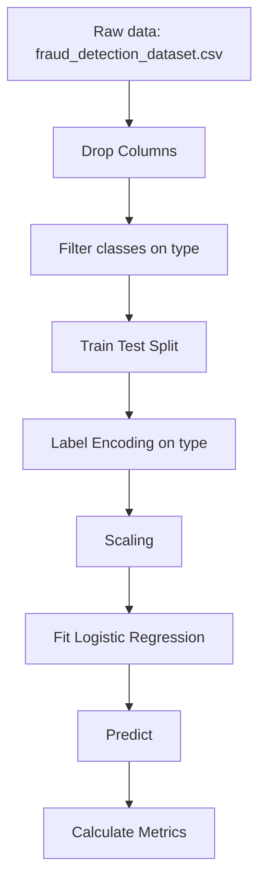
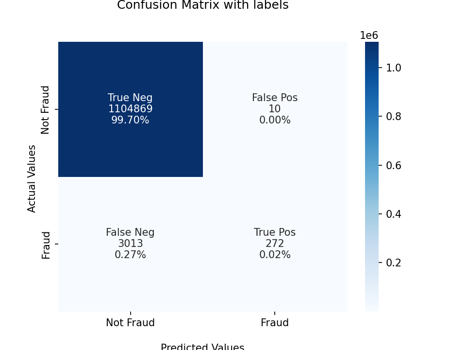

These was the steps of my baseline using **Logistic Regression** and very simple transformations. The data was not balanced by any technique and the model was not tunned as well. 

- **File name:** `lrc_baseline.sav`

## Pipeline

## Confusion Matrix

