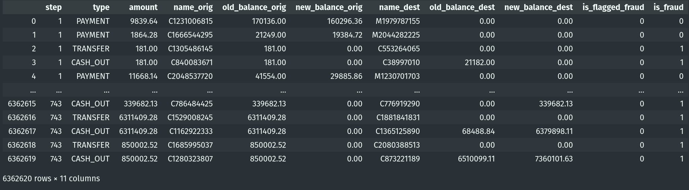
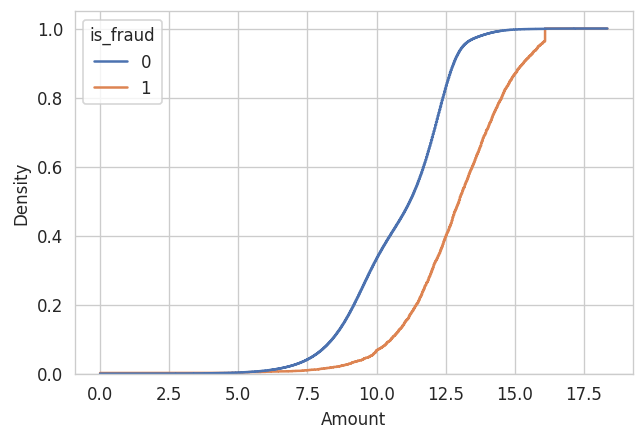
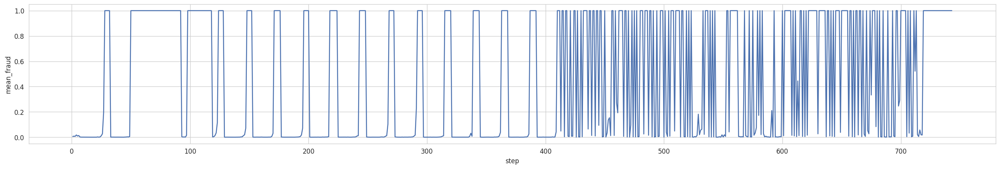
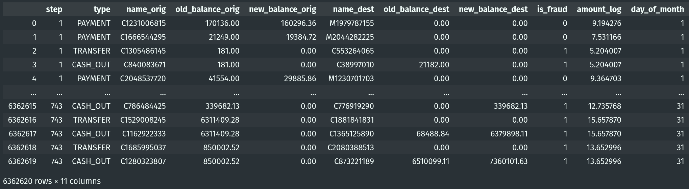

## :fontawesome-solid-money-bill-alt: Fraud Detection EDA


> A fraudulent action here is the act of invade some user bank account, and empty it by transferring it to another account and them withdrawing the money.

If you want to look at the full code of others EDAs and functions used here, you can access the [repository](https://github.com/LucianoBatista/fraud-detection-classifier).

### Libraries 

```py
import pandas as pd
import numpy as np

import seaborn as sns
import matplotlib.pyplot as plt
import matplotlib as mpl

import pingouin as pg
import math 

import warnings

from src.plotting.plotting import bar_plot, ecdf_plot, boxplot_plot

# supressing warnings
warnings.filterwarnings("ignore")

mpl.rcParams["figure.dpi"] = 120
sns.set_style("whitegrid")
sns.set_palette("deep")
```

### Our Dataset

```py
# data
fraud_detect_df = pd.read_csv("data/fraud_detection_dataset.csv")
fraud_detect_df.columns = [
    "step",
    "type",
    "amount",
    "name_orig",
    "old_balance_orig",
    "new_balance_orig",
    "name_dest",
    "old_balance_dest",
    "new_balance_dest",
    "is_fraud",
    "is_flagged_fraud",
]

# change the order, last columns with the target
fraud_detect_df = fraud_detect_df[
    [
        "step",
        "type",
        "amount",
        "name_orig",
        "old_balance_orig",
        "new_balance_orig",
        "name_dest",
        "old_balance_dest",
        "new_balance_dest",
        "is_flagged_fraud",
        "is_fraud",
    ]
]
```



### How unbalanced is our data?

```py
balance_df = fraud_detect_df["is_fraud"].value_counts(normalize=True).reset_index()
balance_df["index"] = balance_df["index"].replace({0: "not fraud", 1: "fraud"})
balance_df["is_fraud"] = round(balance_df["is_fraud"], 4)

# plot
bar_plot(balance_df, x="is_fraud", y="index", xlabel="Proportion", ylabel="")
```


### How `is_fraud` is distributed on our categorical variable `type`?

```py
type_by_fraud_df = fraud_detect_df[["type", "is_fraud"]].value_counts(normalize=True).reset_index()
type_by_fraud_df.columns = ["type", "is_fraud", "prop"]
type_by_fraud_df["is_fraud"] = type_by_fraud_df["is_fraud"].replace({0: "not fraud", 1: "fraud"})
type_by_fraud_df["prop"] = round(type_by_fraud_df["prop"], 4)

bar_plot(type_by_fraud_df, x="prop", y="type", xlabel="Proportion", ylabel="", hue="is_fraud")
```


Let's perform a Chi2 test, and check if the correlation with our target (`is_fraud`) is significant (our alternative hypothesis).

```py
observed, expected, stats = pg.chi2_independence(fraud_detect_df, x="type", y="is_fraud")
stats.round(4)
```


As wee see, this is a nice variable to add to our model, very low p-values on different tests.

### What about the variable `is_flagged_fraud`?

```py
is_ff_df = fraud_detect_df["is_flagged_fraud"].value_counts().reset_index()
is_ff_df.columns = ["is_fraud", "count"]

fraud_detect_df.drop(["is_flagged_fraud"], axis=1, inplace=True)
```

| is_fraud | count |
| :--------: | :-----: |
| 0 | 6.362.604 |
| 1 | 16 |

This variable is not representative, for now wi'll just drop it.


### Let's look at the amount variable

We'll be using the ECDF plot here because the size of the dataset is too large, and because of the scale, is really difficult to see, in a meaningful way, the distribution.

The ECDF plot will bring on y-axis the percentiles, and x-axis your values for the numeric variable.

```py
ecdf_plot(
    data=fraud_detect_df, 
    x="amount", 
    xlabel="Amount", 
    ylabel="Density", 
    hue="is_fraud"
)
```


Both of the distributions are skewed to the left, and in 60% of the time will be very difficult to distinguish if is fraud or not, based on those values. So, lets bring those variables to a more normal distribution applying the log transformation.

```py
# applying log transformation on this variable
def log_transform(x):
    log_transformed = np.log(x + 1)
    return log_transformed

fraud_detect_df["amount_log"] = fraud_detect_df["amount"].apply(log_transform)
fraud_detect_df
# let's see for the amount after the transformation
ecdf_plot(
    data=fraud_detect_df, 
    x="amount_log", 
    xlabel="Amount", 
    ylabel="Density", 
    hue="is_fraud"
)
```



Now, in most of the cases we can clearly see that exist difference between fraud and not fraud based on log transformed values of the `amount` category. Observing those values as a boxplot, we can see the difference on the medians and infer that those distributions are really different.

```py
_ = sns.boxplot(x="is_fraud", y="amount_log", data=fraud_detect_df)
plt.show()
```


So, seems reasonable that we use `amount_log` for the the rest of the analysis.

```py
# droping amount variable
fraud_detect_df.drop(["amount"], axis=1, inplace=True)
fraud_detect_df
# let's check this variable related to the type of the transaction
boxplot_plot(
    data=fraud_detect_df,
    x="type",
    y="amount_log",
    hue="is_fraud",
    xlabel="",
    ylabel="Amount (log scale)",
)
```


In most of the cases we can see a clear distinction between `type`, `amount` and `is_fraud`. But, for `TRANSFER` class, the distributions are very similar. Maybe if we remove some lower outliers we could improve the distinction between those distributions, for now, we'll continue without handling outliers.


### How the hour of the transaction is related to `is_fraud`?

The `step` variable is the **hour of the transaction**.

```py
fraud_on_hours_summary_df = (
    fraud_detect_df.groupby(["step"])["is_fraud"]
    .agg(
        count_fraud=sum,
        mean_fraud=np.mean,
        median_fraud=np.median,
        count_values=np.size,
    )
    .reset_index()
)

# line plot
fig_dims = (27, 4)
fig, ax = plt.subplots(figsize=fig_dims)
_ = sns.lineplot(x="step", y="mean_fraud", data=fraud_on_hours_summary_df, ax=ax)
plt.show()
```



This pattern is interesting because seems that there is a threshold on 400hr region, where we have really different kind of distributions. So, I checked what is happing before and after this period regarding to `is_fraud` variable.

| is_fraud | count before_400hr | count after_400hr |
| -------- | ------------ | ----------- |
| 0 | 5.782K | 571K |
| 1 | 4.4K | 3.7K |

We're seeing that we have less data on the second block of the plot, especially for non-fraud. Otherwise, the quantity of fraud stay very similar on both blocks. So, the percentage of fraud on the first 400 hours is **0.0773%** and on the second is **0.649%**

We can also create another variable regarding the day of the month that those ours represent, and perform our analyse on both variables.

```py
def get_day(x: int):
    division = x / 24
    dom = math.ceil(division)
    return dom

fraud_detect_df["day_of_month"] = fraud_detect_df["step"].apply(get_day)
```



Now, we'll see how this variable is related to `is_fraud` and the `amount_log`, but also we'll look at the boxplot for each of the classes on `type` that have fraud on the observation. 

```py
df_to_plot = fraud_detect_df[fraud_detect_df["type"] == "TRANSFER"]

boxplot_plot(
    x="day_of_month",
    y="amount_log", 
    data=df_to_plot, 
    hue="is_fraud", 
    xlabel="Day of the month", 
    ylabel="Amount (log scale)", 
    title="Regarding type == 'TRANSFER'", 
    horizontal=True
)
```


```py
df_to_plot = fraud_detect_df[fraud_detect_df["type"] == "CASH_OUT"]

boxplot_plot(
    x="day_of_month",
    y="amount_log", 
    data=df_to_plot, 
    hue="is_fraud", 
    xlabel="Day of the month", 
    ylabel="Amount (log scale)", 
    title="Regarding type == 'CASH_OUT'", 
    horizontal=True
)
```


Was observed that the **amount variable**, is related just to the difference between origin and not the destination. So, let's add this variable to our dataset.

```py
fraud_detect_df["amount_dest"] = abs((fraud_detect_df["old_balance_dest"]) - (fraud_detect_df["new_balance_dest"]))
fraud_detect_df["amount_dest_log"] = fraud_detect_df["amount_dest"].apply(log_transform)

```

And also, investigate the those boxplots.

```py
df_to_plot = fraud_detect_df[fraud_detect_df["type"] == "TRANSFER"]

boxplot_plot(
    x="day_of_month",
    y="amount_dest_log", 
    data=df_to_plot, 
    hue="is_fraud", 
    xlabel="Day of the month", 
    ylabel="Amount (log scale)", 
    title="Regarding type == 'TRANSFER'", 
    horizontal=True
)

df_to_plot = fraud_detect_df[fraud_detect_df["type"] == "CASH_OUT"]
```


```py
boxplot_plot(
    x="day_of_month",
    y="amount_log", 
    data=df_to_plot, 
    hue="is_fraud", 
    xlabel="Day of the month", 
    ylabel="Amount (log scale)", 
    title="Regarding type == 'CASH_OUT'", 
    horizontal=True
)
## Exporting our final dataset for modeling
final_fraud_df = fraud_detect_df[["day_of_month", "type", "amount_log", "amount_dest_log", "is_fraud"]]
final_fraud_df.to_csv("data/second-eda-output.csv", index=False)
```


### The Final Dataset

