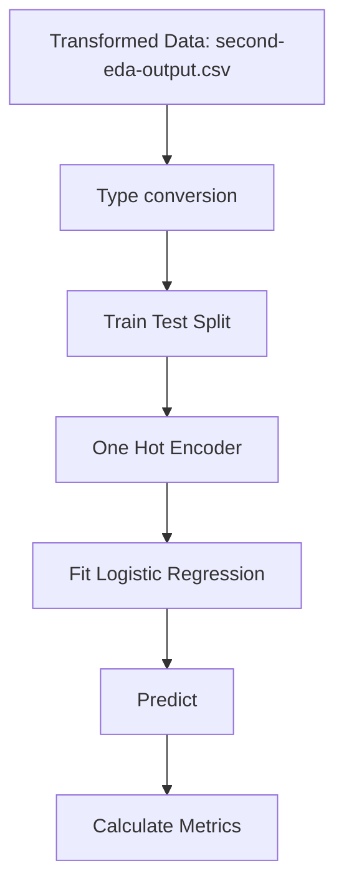

These was the steps of the *model-v1* using **Logistic Regression**, I also used feature engineering and numerical and categorical transformations. The data was not balanced by any technique and the model was not tunned as well. 

- **File name:** `19_01_22_lr_v1.sav`

## Pipeline

