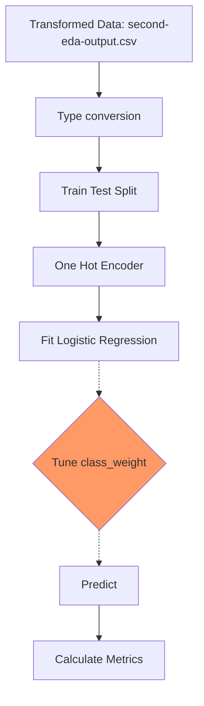
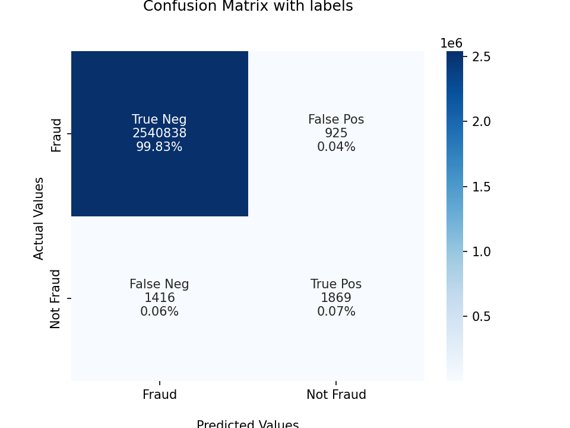
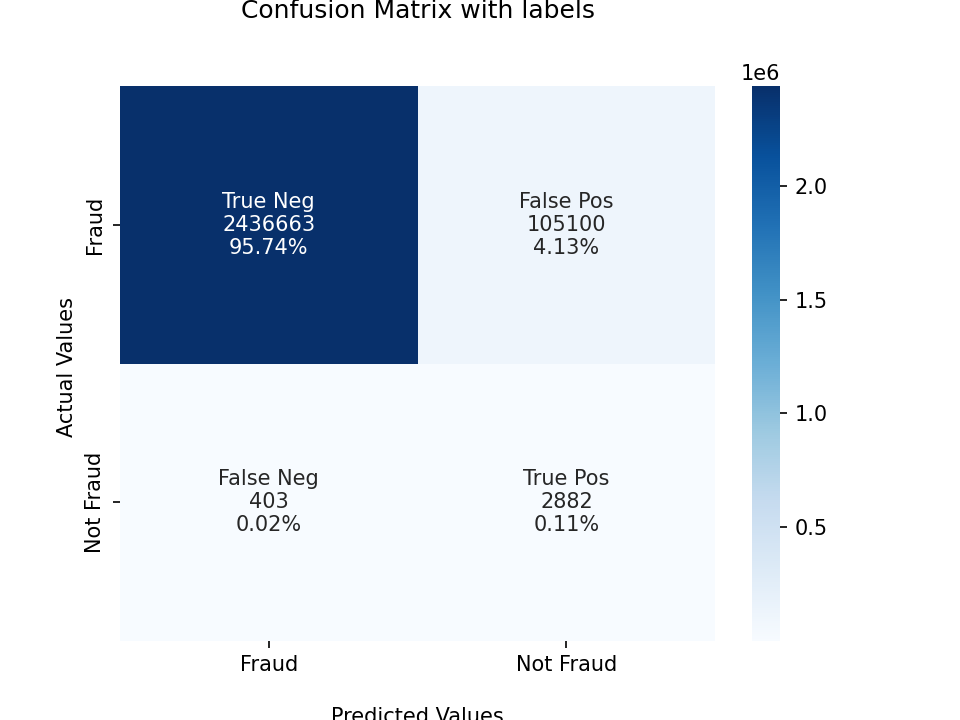

These was the steps of the *model-v2* using **Logistic Regression**, I also used feature engineering and numerical and categorical transformations. 

On the logistic regression was applied the `class_weight` parameter, with the following values:

- `class_weight`: "balanced" and {0: 0.10, 1: 0.90}

Those models are `21_01_22_lr_w_v1.sav` for dict-like params, and `21_01_22_lr_w_v2.sav`

## Pipeline

## Confusion Matrix

### V2

### V3

