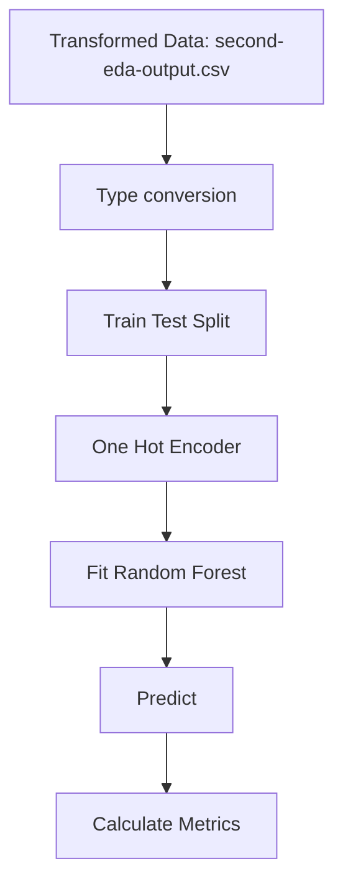
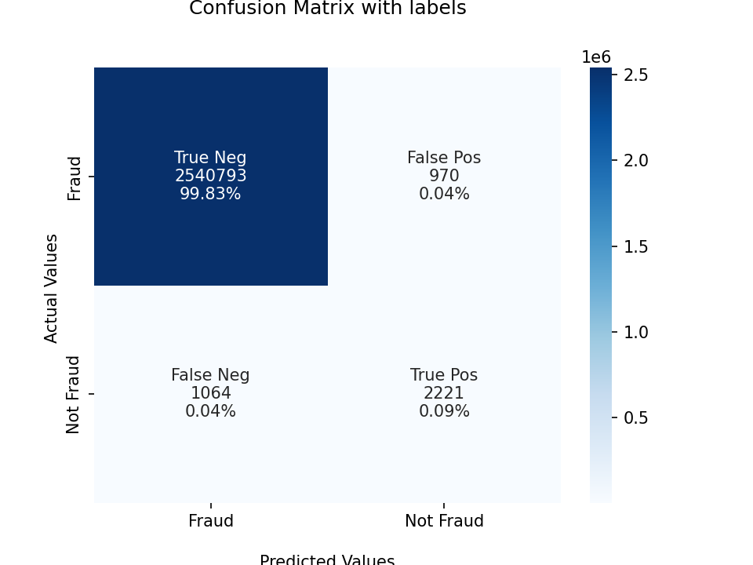
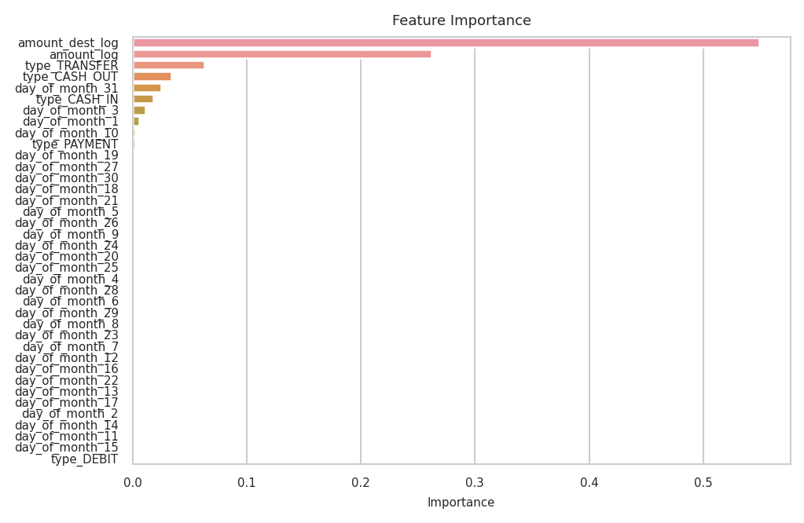

These was the steps of the *model-v4* using **Random Forest**, I also used feature engineering and numerical and categorical transformations. 

The model is `21_01_22_lr_w_v3.sav`, and can be found on the respective directory.

## Pipeline

## Confusion Matrix

## Feature Importance

